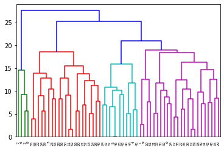

# Finding the similarities and differences in the anomalous behaviour in Temperature over Indian Subcontinent
## Dataset 
The dataset has been taken from NATIONAL CENTRE FOR MEDIUM RANGE WEATHER FORECASTING using their REANALYSIS DATA SERVICES for downloading high resolution data between the dates 1979-2019

## Hierarchical Clustering of Anomalous Temperatures

First, the data points are collected as the difference between the average temperature of each day and the average temperature of each month. Monthly averages are taken to check for abrubt changes in the temperature conditions. Then Hierarchical Clustering has been applied to this time series data to get local clusters of similar anomalies.

